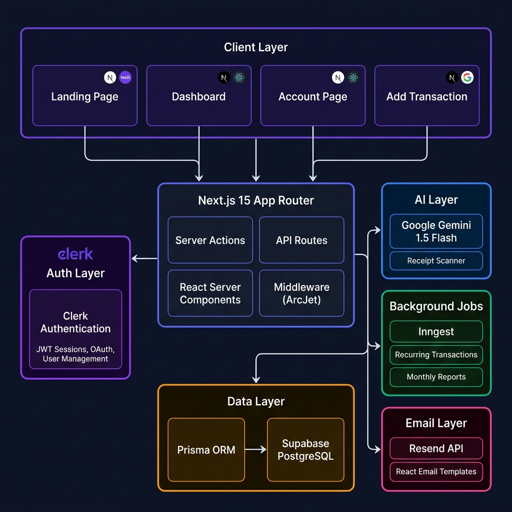
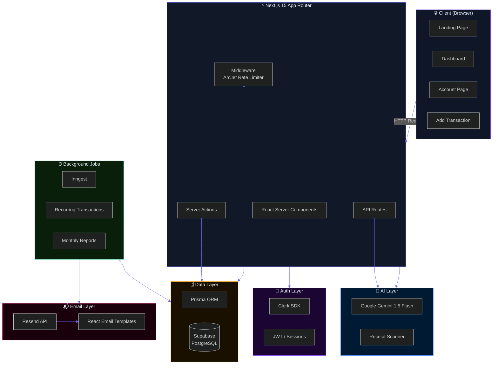

<div align="center">

<br />


<br /><br />

# 💜 Finnova — Intelligent Finance Platform

**A production-grade, AI-powered personal finance platform built with the modern full-stack.**  
Track income & expenses, scan receipts with AI, visualize trends, and manage multiple accounts — all in a premium dark-mode UI.

<br />

[](https://finnova.vercel.app)
[](https://github.com/Abk700007/Finnova/stargazers)
[](LICENSE)

</div>

---

## 📸 Screenshots

| Landing Page | Dashboard |
|---|---|
|  |  |

---

## ✨ Features

| Category | Features |
|---|---|
| 🔐 **Authentication** | Clerk-powered sign-up / sign-in, OAuth, session management |
| 💳 **Accounts** | Create multiple accounts (Checking, Savings), set default account, real-time balance |
| 📊 **Dashboard** | Total balance, monthly income/expense, savings rate, budget progress, recent transactions |
| 📈 **Analytics** | Interactive bar charts (income vs expense), donut expense breakdown by category |
| 🤖 **AI Receipt Scanner** | Upload a receipt image → Gemini AI extracts amount, date & category automatically |
| 🔁 **Recurring Transactions** | Daily / Weekly / Monthly / Yearly auto-scheduling via Inngest cron jobs |
| 📬 **Email Alerts** | Budget exceeded alerts and monthly report emails via Resend + React Email |
| 🛡️ **Rate Limiting** | ArcJet-powered bot protection and request rate limiting on API routes |
| 📱 **Responsive** | Mobile-first design — works beautifully across all screen sizes |

---

## 🏗️ Architecture



<details>
<summary>📐 View as interactive Mermaid diagram</summary>



</details>

---

## 🛠️ Tech Stack

| Layer | Technology | Purpose |
|---|---|---|
| **Framework** | [Next.js 15](https://nextjs.org) (App Router) | Full-stack React framework |
| **Language** | JavaScript (ES2024) | Runtime language |
| **Styling** | [Tailwind CSS v3](https://tailwindcss.com) + Custom design system | Utility-first CSS |
| **UI Components** | [shadcn/ui](https://ui.shadcn.com) (Radix primitives) | Accessible component library |
| **Charts** | [Recharts](https://recharts.org) | Data visualization |
| **Authentication** | [Clerk](https://clerk.com) | Auth + user management |
| **ORM** | [Prisma](https://prisma.io) | Type-safe database access |
| **Database** | [Supabase](https://supabase.com) (PostgreSQL) | Managed database |
| **AI** | [Google Gemini 1.5 Flash](https://ai.google.dev) | Receipt scanning & insights |
| **Background Jobs** | [Inngest](https://inngest.com) | Cron jobs & event-driven workflows |
| **Email** | [Resend](https://resend.com) + [React Email](https://react.email) | Transactional emails |
| **Rate Limiting** | [ArcJet](https://arcjet.com) | Bot protection & rate limiting |
| **Form Handling** | [React Hook Form](https://react-hook-form.com) + [Zod](https://zod.dev) | Type-safe forms |
| **Deployment** | [Vercel](https://vercel.com) | Edge-optimized hosting |

---

## 📁 Project Structure

```
finnova/
├── app/
│   ├── (auth)/                  # Clerk sign-in / sign-up routes
│   ├── (main)/
│   │   ├── dashboard/           # Main dashboard page + components
│   │   │   └── _components/
│   │   │       ├── account-card.jsx
│   │   │       ├── budget-progress.jsx
│   │   │       └── transaction-overview.jsx
│   │   ├── account/[id]/        # Individual account page
│   │   │   └── _components/
│   │   │       ├── account-chart.jsx
│   │   │       └── transaction-table.jsx
│   │   └── transaction/
│   │       ├── create/          # Add / Edit transaction page
│   │       └── _components/
│   │           ├── transaction-form.jsx
│   │           └── recipt-scanner.jsx
│   ├── api/
│   │   └── inngest/             # Inngest event handler
│   ├── lib/
│   │   └── schema.js            # Zod validation schemas
│   ├── globals.css              # Design system & Tailwind base
│   └── layout.js               # Root layout
├── actions/                     # Next.js Server Actions
│   ├── account.js
│   ├── budget.js
│   ├── dashboard.js
│   └── transaction.js
├── components/
│   ├── header.jsx               # Navigation header
│   ├── hero.jsx                 # Landing hero section
│   ├── create-account-drawer.jsx
│   └── ui/                      # shadcn/ui base components
├── data/
│   ├── categories.js            # Default transaction categories
│   └── landing.js               # Landing page content data
├── emails/
│   └── template.jsx            # React Email templates
├── hooks/
│   └── use-fetch.js            # Custom hook for server action calls
├── lib/
│   ├── arcjet.js
│   ├── checkUser.js
│   ├── inngest/                 # Inngest functions
│   └── utils.js
├── prisma/
│   └── schema.prisma           # Database schema
├── public/                      # Static assets
├── middleware.js               # Clerk + ArcJet middleware
└── next.config.mjs
```

---

## 🚀 Getting Started

### Prerequisites

- Node.js ≥ 18
- npm or yarn
- A [Supabase](https://supabase.com) project (PostgreSQL)
- A [Clerk](https://clerk.com) application
- [Google AI Studio](https://ai.google.dev) API key
- [Resend](https://resend.com) API key
- [ArcJet](https://arcjet.com) API key

### 1. Clone the repository

```bash
git clone https://github.com/Abk700007/Finnova.git
cd Finnova
```

### 2. Install dependencies

```bash
npm install
```

### 3. Configure environment variables

Create a `.env` file in the root directory:

```env
# ── Database (Supabase) ────────────────────────
DATABASE_URL="postgresql://..."
DIRECT_URL="postgresql://..."

# ── Authentication (Clerk) ─────────────────────
NEXT_PUBLIC_CLERK_PUBLISHABLE_KEY=pk_test_...
CLERK_SECRET_KEY=sk_test_...
NEXT_PUBLIC_CLERK_SIGN_IN_URL=/sign-in
NEXT_PUBLIC_CLERK_SIGN_UP_URL=/sign-up
NEXT_PUBLIC_CLERK_AFTER_SIGN_IN_URL=/onboarding
NEXT_PUBLIC_CLERK_AFTER_SIGN_UP_URL=/onboarding

# ── AI (Google Gemini) ─────────────────────────
GEMINI_API_KEY=AIza...

# ── Email (Resend) ─────────────────────────────
RESEND_API_KEY=re_...

# ── Rate Limiting (ArcJet) ─────────────────────
ARCJET_KEY=ajkey_...

# ── Background Jobs (Inngest) ──────────────────
INNGEST_EVENT_KEY=...
INNGEST_SIGNING_KEY=...
```

### 4. Set up the database

```bash
npx prisma generate
npx prisma db push
```

### 5. Run the development server

```bash
npm run dev
```

Open [http://localhost:3000](http://localhost:3000) in your browser.

---

## 🧩 Key Implementation Details

### AI Receipt Scanning
Finnova uses **Google Gemini 1.5 Flash** multimodal capabilities. When a user uploads a receipt image, it's converted to base64 and sent to the Gemini API with a structured prompt requesting JSON output containing `amount`, `date`, `description`, and `category`. The form is then auto-populated.

### Recurring Transactions
**Inngest** scheduled functions run daily to check for due recurring transactions. When a transaction's `nextRecurringDate` matches today, it creates a new transaction and advances the date based on the interval (DAILY/WEEKLY/MONTHLY/YEARLY).

### Budget Alerts
When total monthly expenses exceed the user's set budget, **Resend** triggers a beautiful HTML email (built with React Email) warning the user. A flag prevents duplicate emails within the same month.

### Rate Limiting
**ArcJet** sits in the Next.js middleware and protects all routes from bot abuse and brute-force attacks. The receipt-scanning API route has a stricter per-IP limit.

---

## 🤝 Contributing

Contributions are welcome! Please follow these steps:

1. Fork the repository
2. Create a feature branch: `git checkout -b feat/your-feature`
3. Commit your changes: `git commit -m "feat: add your feature"`
4. Push to the branch: `git push origin feat/your-feature`
5. Open a Pull Request

Please follow [Conventional Commits](https://www.conventionalcommits.org/) for commit messages.

---

## 📄 License

This project is licensed under the **MIT License** — see the [LICENSE](LICENSE) file for details.

---

<div align="center">

Built with 💜 by [Abhiranjan](https://github.com/Abk700007)

⭐ **Star this repo** if you found it helpful!

</div>
